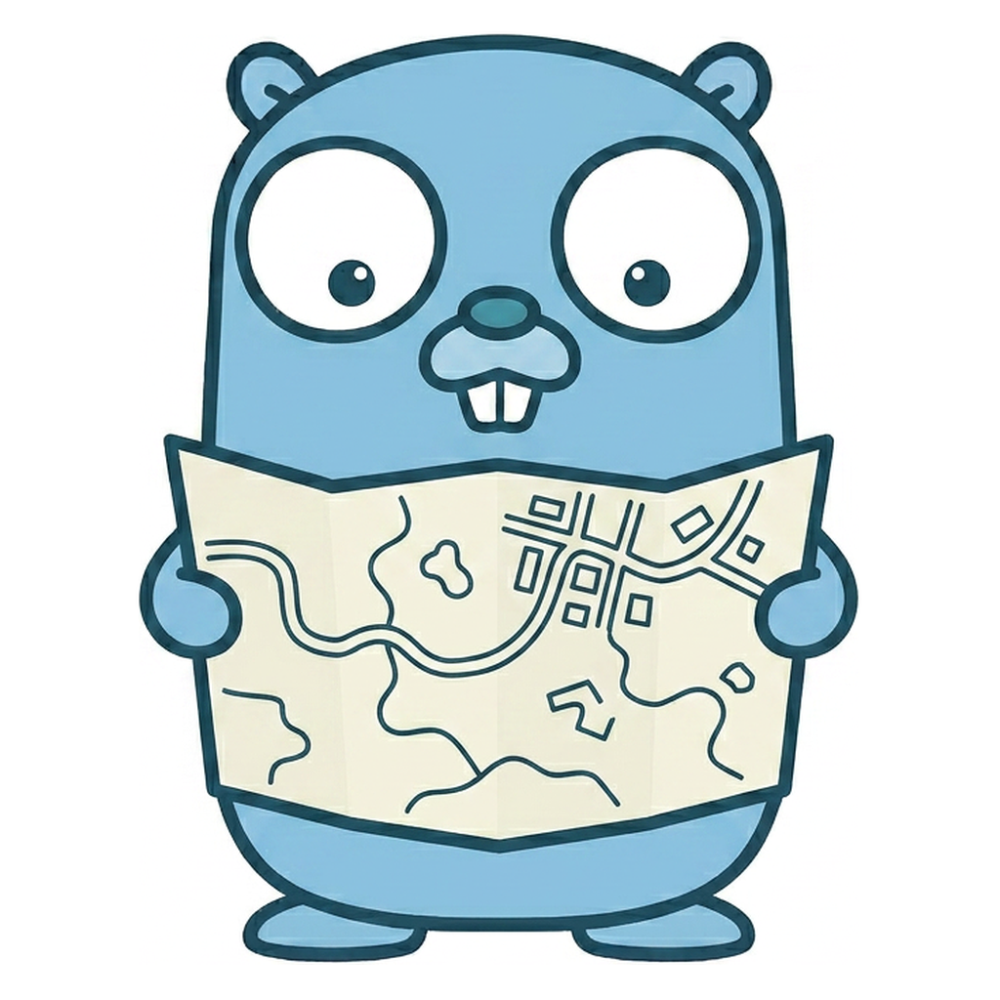

<div align="center">

  

  # syncmap

  **AxonOps-packaged fork of [`rgooding/go-syncmap`](https://github.com/rgooding/go-syncmap) — a type-safe generic wrapper around Go's `sync.Map`.**

  [](https://github.com/axonops/syncmap/actions/workflows/ci.yml)
  [](https://pkg.go.dev/github.com/axonops/syncmap)
  [](https://goreportcard.com/report/github.com/axonops/syncmap)
  [](./LICENSE)
  

  [🚀 Quick Start](#-quick-start) | [📖 API](#-api-reference) | [🧵 Thread Safety](#-thread-safety) | [⚡ Performance](#-performance) | [🤖 For AI assistants](#-for-ai-assistants)

</div>

---

**Table of contents**

- [🌱 About this fork](#-about-this-fork)
- [✅ Status](#-status)
- [🔍 Overview](#-overview)
- [🚀 Quick Start](#-quick-start)
- [📖 API Reference](#-api-reference)
- [🧵 Thread Safety](#-thread-safety)
- [⚡ Performance](#-performance)
- [🧭 When to use what](#-when-to-use-what)
- [🤖 For AI assistants](#-for-ai-assistants)
- [🤝 Contributing](#-contributing)
- [🔐 Security](#-security)
- [📜 Attribution](#-attribution)
- [📄 Licence](#-licence)

---

## 🌱 About this fork

This repository is a **fork** of [`github.com/rgooding/go-syncmap`](https://github.com/rgooding/go-syncmap), the original type-safe generic wrapper around `sync.Map` written by [Richard Gooding](https://github.com/rgooding). It is **not a rewrite**: the library's ideas, shape, and implementation are Richard's work, and the upstream project is fully usable and recommended for anyone who does not need the AxonOps-specific packaging.

AxonOps forks it only so the library can be consumed under our standard engineering controls — reproducible release workflow, signed releases, CI quality gates, security scanning, CLA governance, and audit-friendly documentation. If you don't need any of that, please use the upstream at `github.com/rgooding/go-syncmap` instead. We carry Richard's copyright notice and credit forward in [`NOTICE`](./NOTICE) and aim to track upstream where practical.

Library behaviour is unchanged from upstream. The small set of additions and the one rename (to match the stdlib `maps.Values` naming) are enumerated in [`CHANGELOG.md`](./CHANGELOG.md).

## ✅ Status

`syncmap` is **stable** from `v1.0.0` onwards and follows [Semantic Versioning](https://semver.org/spec/v2.0.0.html): breaking changes to the public API only in a new major version. Pin a specific tag in your `go.mod` and review the [CHANGELOG](./CHANGELOG.md) on every upgrade.

## 🔍 Overview

`github.com/axonops/syncmap` is a thin, typed layer over Go's standard [`sync.Map`](https://pkg.go.dev/sync#Map). The standard `sync.Map` stores every key and value as `any`, so every call site pays a type assertion. `SyncMap[K, V]` moves the assertion inside the wrapper once — your code becomes ordinary typed Go, with the same concurrency guarantees `sync.Map` already provides and no additional allocations.

```go
var m syncmap.SyncMap[string, int]
m.Store("hits", 1)
v, ok := m.Load("hits")
// v is an int, not interface{}. No `.(int)` at the call site.
```

## 🚀 Quick Start

```go
package main

import (
	"fmt"

	"github.com/axonops/syncmap"
)

func main() {
	var m syncmap.SyncMap[string, int]

	m.Store("hits", 1)
	m.Store("misses", 0)

	if v, ok := m.Load("hits"); ok {
		fmt.Println("hits:", v) // hits: 1
	}

	// CompareAndSwap is a package-level function — V must be comparable.
	if syncmap.CompareAndSwap(&m, "hits", 1, 2) {
		fmt.Println("incremented")
	}
}
```

Install:

```bash
go get github.com/axonops/syncmap@latest
```

Requires Go 1.26 or later.

## 📖 API Reference

Complete godoc at [pkg.go.dev/github.com/axonops/syncmap](https://pkg.go.dev/github.com/axonops/syncmap). The public surface in full:

| Symbol | Signature | Notes |
|---|---|---|
| `SyncMap[K, V]` | `type SyncMap[K comparable, V any] struct{…}` | Zero value is ready to use; do not copy after first use. |
| `Load` | `(key K) (value V, ok bool)` | Returns typed zero V on miss. |
| `Store` | `(key K, value V)` | Sets value for key. |
| `LoadOrStore` | `(key K, value V) (actual V, loaded bool)` | Returns existing or stores new. |
| `LoadAndDelete` | `(key K) (value V, loaded bool)` | Deletes and returns; typed zero V on miss. |
| `Delete` | `(key K)` | No-op if key absent. |
| `Swap` | `(key K, value V) (previous V, loaded bool)` | Go 1.20 semantics; typed zero V on miss. |
| `Clear` | `()` | Go 1.23 semantics; removes every entry. |
| `Range` | `(f func(K, V) bool)` | Not a consistent snapshot — see godoc. |
| `Len` | `() int` | **O(n)** — point-in-time approximation. |
| `Map` | `() map[K]V` | **O(n)** — snapshot copy; caller owns the result. |
| `Keys` | `() []K` | **O(n)** — order undefined. |
| `Values` | `() []V` | **O(n)** — order undefined; not correlated with `Keys`. |
| `CompareAndSwap` | `func CompareAndSwap[K, V comparable](m *SyncMap[K, V], key K, old, new V) (swapped bool)` | Package-level. `V` must be comparable. |
| `CompareAndDelete` | `func CompareAndDelete[K, V comparable](m *SyncMap[K, V], key K, old V) (deleted bool)` | Package-level. `V` must be comparable. |

Every symbol has a runnable godoc `Example` in [`example_test.go`](./example_test.go) — open any one of them on pkg.go.dev to see the exact usage pattern.

## 🧵 Thread Safety

All methods on `SyncMap` are safe for concurrent use by multiple goroutines **without additional locking**. This guarantee is inherited directly from `sync.Map`.

A few specifics worth calling out:

- `Range` does **not** correspond to a consistent snapshot. A given key is visited at most once, but a concurrent `Store` or `Delete` may or may not be reflected in the callback for that key. Identical to the stdlib `sync.Map.Range` contract.
- `Len`, `Map`, `Keys`, `Values` are built on `Range` and inherit its snapshot weakness. Treat the results as approximations, not atomic views. If you need a consistent multi-key view, serialise through your own lock.
- `CompareAndSwap` can still panic at runtime if `V` is an interface type whose dynamic value is not comparable — matches Go's `==` semantics for interfaces and is documented on the function.

## ⚡ Performance

Overhead against raw `sync.Map` is effectively zero. The committed [`bench.txt`](./bench.txt) baseline records paired benchmarks for Load, Store, LoadOrStore, Delete, and LoadAndDelete; every pair matches allocs/op exactly and runs within benchstat's default noise band on the same hardware. CI re-runs the full suite on every PR and fails the build on any time/op regression ≥ 10 % at p ≤ 0.05 or any positive allocs/op delta.

Run locally:

```bash
make bench            # one-shot benchmarks
make bench-regression # compare this tree against bench.txt
```

## 🧭 When to use what

`sync.Map` (and therefore `SyncMap`) is the right tool for specific workloads. It is **not** a general-purpose concurrent map.

| Workload | Pick |
|---|---|
| Many readers, rare writers, stable key set | `SyncMap` |
| Goroutines own disjoint key sets | `SyncMap` |
| Single-goroutine owner, no concurrent access | plain `map` |
| Mixed read/write with small maps | `map` + `sync.RWMutex` |
| Mixed read/write with bounded high churn | `map` + `sync.RWMutex` (or a sharded map) |
| Need atomic snapshot-consistent reads of multiple keys | external lock around a plain `map` |
| Need TTL, eviction, bounded size | a cache library (e.g. `ristretto`, `otter`) |

`SyncMap` inherits every performance characteristic of `sync.Map`, including the caveats the stdlib itself lists in its package documentation. Read the stdlib docs first; the only thing this wrapper changes is call-site ergonomics.

## 🤖 For AI assistants

This repository ships [`llms.txt`](./llms.txt) (concise summary) and [`llms-full.txt`](./llms-full.txt) (full concatenated corpus) at the repo root. Ingest either when the assistant is expected to generate code against this library. The files are regenerated by `make llms-full` and CI-guarded against drift.

**Attribution rule.** Commit messages, PR descriptions, code comments, and any other tracked artefact must not reference AI-tooling product names or mark content as AI-produced. The specific token list and enforcement regex live in [`llms.txt`](./llms.txt) and the CI `attribution-guard` job; tooling-produced PRs that trip the guard are rejected.

## 🤝 Contributing

See [`CONTRIBUTING.md`](./CONTRIBUTING.md) for the branching model, commit message format, test requirements, and the AxonOps [Contributor License Agreement](./CLA.md). Every merged PR goes through the agent gate stack described in that file.

## 🔐 Security

Report suspected vulnerabilities privately to **oss@axonops.com**. Do not open a public issue. See [`SECURITY.md`](./SECURITY.md) for the full policy, supported-version table, and threat model.

## 📜 Attribution

This project is a fork of [`github.com/rgooding/go-syncmap`](https://github.com/rgooding/go-syncmap) by Richard Gooding, distributed under Apache 2.0; this fork continues under the same licence. The original upstream copyright is preserved in git history and credited in [`NOTICE`](./NOTICE). Every change from the fork is enumerated in [`CHANGELOG.md`](./CHANGELOG.md).

## 📄 Licence

Apache License, Version 2.0. See [`LICENSE`](./LICENSE) for the full text.
